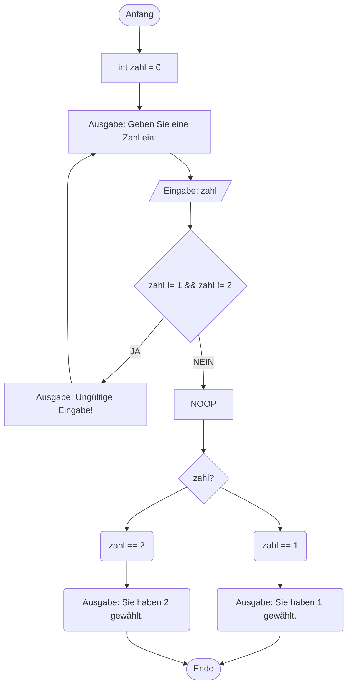

Aufgabe 4 Programmablaufplan:

```mermaid
flowchart TD
    a([Anfang]) --> b[int zahl = 0]
    b --> c[Ausgabe: Geben Sie eine Zahl ein:]
    c --> d[/Eingabe: zahl/]
    d --> e{zahl != 1 && zahl != 2}
    e --JA--> f[Ausgabe: Ungültige Eingabe!]
    e --NEIN--> g[NOOP]
    f --> c
    g --> h{zahl?}
    h --> i(zahl == 1)
    h --> j(zahl == 2)
    i --> k(Ausgabe: Sie haben 1 gewählt.)
    j --> l(Ausgabe: Sie haben 2 gewählt.)
    k --> m([Ende])
    l --> m
```